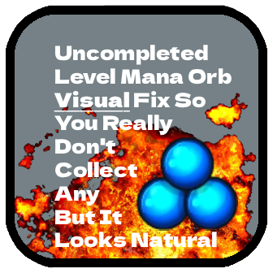

#  Auto Like 
# Uncompleted Orb Visual Fix 
_jesus that does not roll of the toung lol_

If you've ever uncompleted a level before because you accidentially hacked it, you've probably noticed that orbs and diamonds are not reset. This mod restores the visual effects for gaining orbs on those uncompleted levels; no unintended stats are collected.

### Disclaimer: 
When you die you may notice the collected orbs / diamonds in the corner are increasing, however, the game simply visually removes the gained orbs, and then adds them back to get your current unmodified orb count. 

Mod created by HBG and suggested by PenPenLiddy

